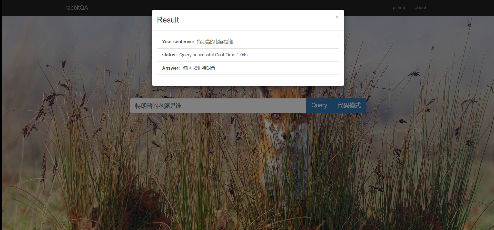
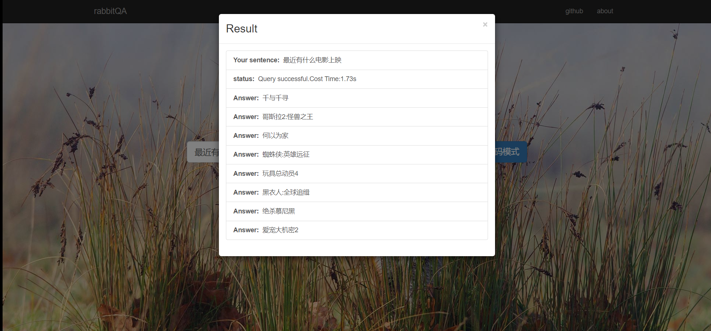
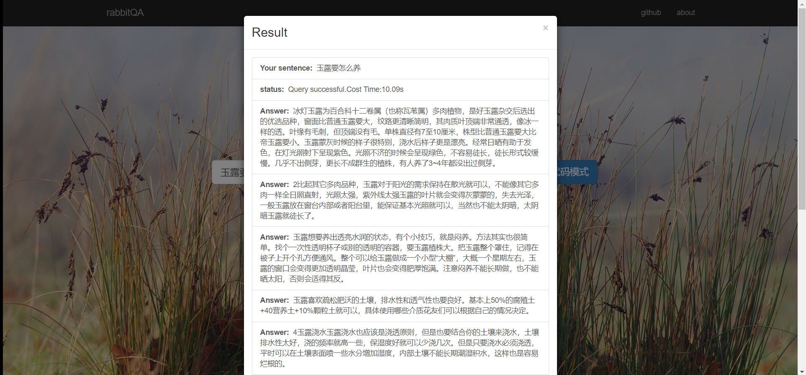
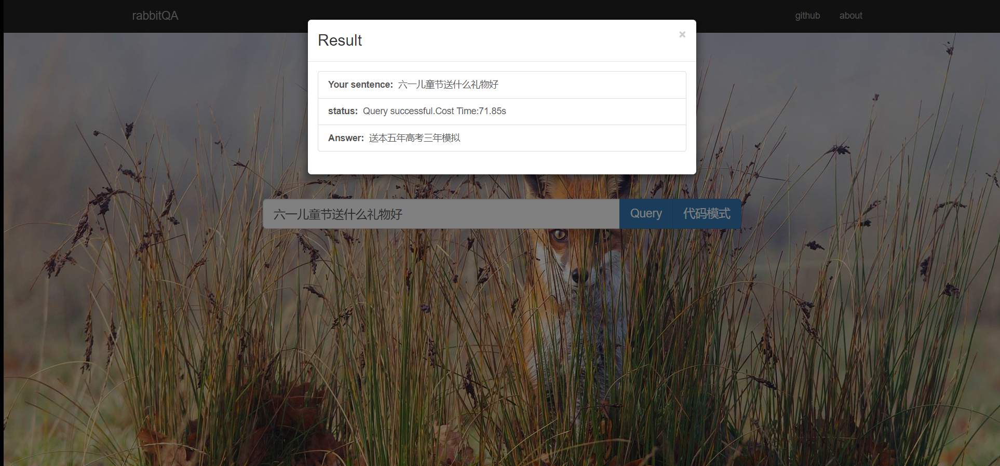

# rabbitQA
中文问答系统：使用NLP相关技术，对搜索引擎，问答社区等进行信息抽取，文本概括等，支持通识问答，社区问答和部分专业问答

### 下载

因为使用了word2vec和sqlite3，有两个>100M的二进制文件，github不允许直接上次,请在release tag上下载。

### 环境

python 3 

### How to use

- 进入到对应目录，使用pip 安装相关环境。

```
pip install -r requriements.txt
```


- 然后打开server,默认会监听0.0.0.0:8888

```
python server.py
```


- 打开任一款浏览器,输入localhost:8888即可访问


### 搜索模式

- 普通模式（默认）

  搜索引擎怎么用就怎么用。

- 代码模式

  在代码模式中，有为了检测出代码做的特殊优化。因为更希望获得的命令和代码例程，会更鼓励获取含英文的答案。

  当query中含有中文时，会再CSDN等中文门户内提取答案。而query为纯英文+符号时，会从StackOverflow挑选被采纳的答案。


### 例子

- 通识问答





 


- 社区问答



- 代码问答


### 未来优化

- 更完善的社区回答，可以考虑在答案中提取关键信息，再由算法根据Template或Generative Model重新组织语言，生成神回复。
- 增大社区问答相关的数据库，提高查询效率。
- 完善抽取信息，概括信息算法的能力。

- 提供更专业的问答